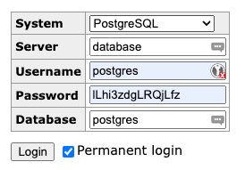
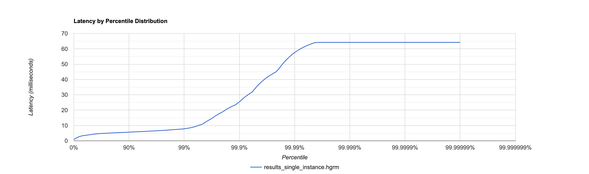
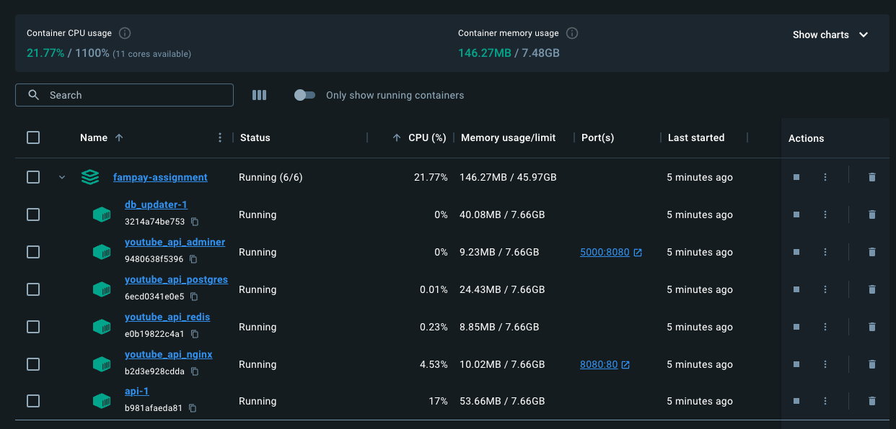
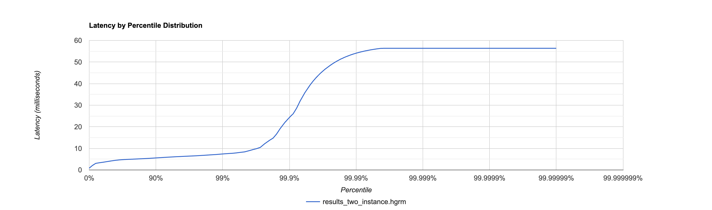
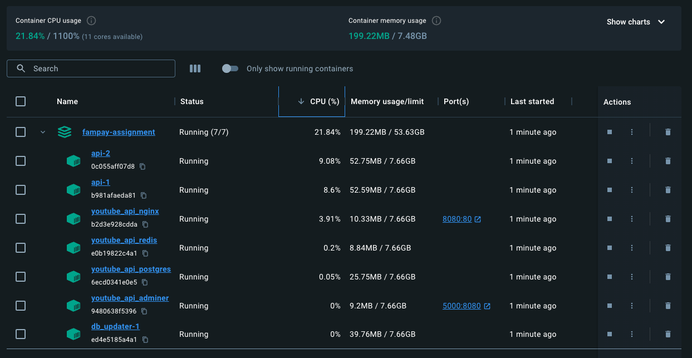
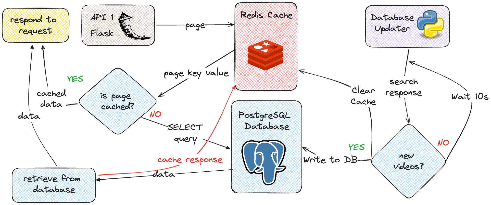

# Fampay Backend Assignment (Youtube API)

## Setup Instructions
0. Clone the repository
```bash
# git
git clone https://github.com/kry0sc0pic/fampay-youtube-api.git

# github cli
gh repo clone kry0sc0pic/fampay-youtube-api
```
1. Copy `.env.example` to `.env`
2. Create Youtube API Keys and replace the `<key1>` and `<key2>` placeholders. Feel free to add more if you like. [Here](https://scribehow.com/shared/Get_API_key_for_Fampay_Assignment__yJsvVKDUT4SFxx3DJ4Yh9Q) is a tutorial to create an API Key.
2. Unless you want to change ports and other settings, you should be good to go!

## Starting / Stopping
You can spin up/down all the services using docker compose using the following command.

```bash
# Start All Services
docker compose up -d --build

# Stop All Services
docker compose down
```

## Accessing Services
### Dashboard


**URL ->** [http://localhost:8501](http://localhost:8501)

### Adminer


**URL ->** [http://localhost:5000](http://localhost:5000)

**Credentials**



## API Documentation


**Base URL:** `http://localhost:8080`

### GET /videos
Returns the videos from the database in batches of 20. Supports pagination.

**URL Params:**
- `page` - The page number to return. Defaults to 1. (Optional)

***Notes***
- if the value of page is greater than number of pages available it will return the last page
- if the value of page is lesser than 1 it will return the first page

## Testing Results
I ran tests with 1,2 and replicas. The latency for 99.5% requests is consistently under 10ms, even when 5 containers were faced with 10x the load that 1&2 Container tests faced. The latency starts to rapidly increase after the 99.5% percentile and flattens out near 60-80ms.

### Testing Methodology

Load testing was done using [Vegeta](https://github.com/tsenart/vegeta). Test result files (`.hgrm`) are available in the `testing_results` folder. They can be plotted using the [HdrHistogram Plotter](https://hdrhistogram.github.io/HdrHistogram/plotFiles.html).

### Hardware/Software Versions Used:
- Macbook Pro M3 Pro (11 core CPU , 18GB RAM)
- Docker Desktop (v2.26.1)

### Test 1
```YAML
API Containers: 1
Test Time: 120 sec (2 minutes)
Rate: 100 req/sec
Results File: results_single_instance.hgrm 
```
***Latency by Percentile Chart***


***Resource Utilization***


**Vegeta Command****
```bash
echo "GET http://localhost:8080/videos/?page=1" | vegeta attack -duration=120s -rate 100 | tee results.bin | vegeta report -type=hdrplot >> results_single_instance.hgrm
```

### Test 2
```YAML
API Containers: 2
Test Time: 120 sec (2 minutes)
Rate: 100 req/sec
Results File: results_two_instance.hgrm
```
***Latency by Percentile Chart***


***Resource Utilization***


**Vegeta Command****
```bash
echo "GET http://localhost:8080/videos/?page=1" | vegeta attack -duration=120s -rate 100 | tee results.bin | vegeta report -type=hdrplot >> results_two_instances.hgrm
```

### Test 3
```YAML
API Containers: 5
Test Time: 120 sec (2 minutes)
Rate: 1000 req/sec
Results File: results_five_instances.hgrm
```
***Latency by Percentile Chart***


***Resource Utilization***


**Vegeta Command****
```bash
echo "GET http://localhost:8080/videos/?page=1" | vegeta attack -duration=120s -rate 1000 | tee results.bin | vegeta report -type=hdrplot >> results_five_instances.hgrm
```

## System Design
### High Level Architecture


### Flowchart
